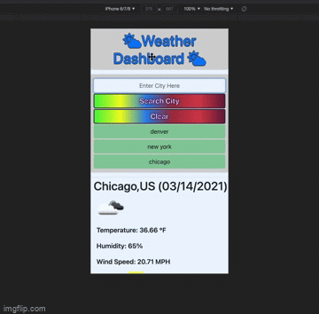
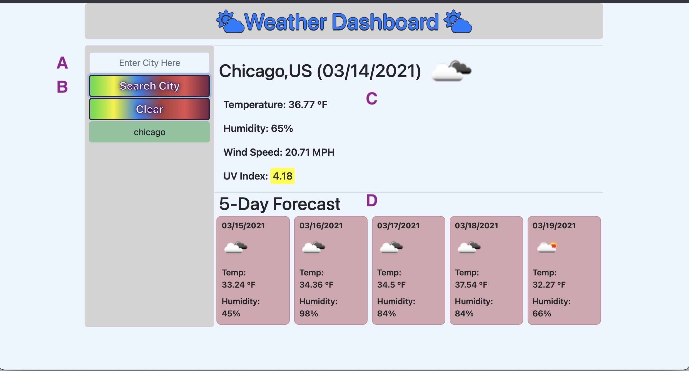
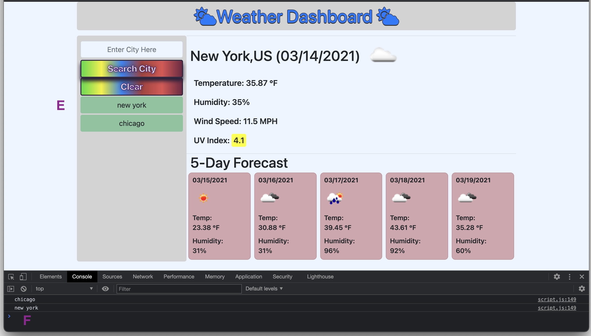
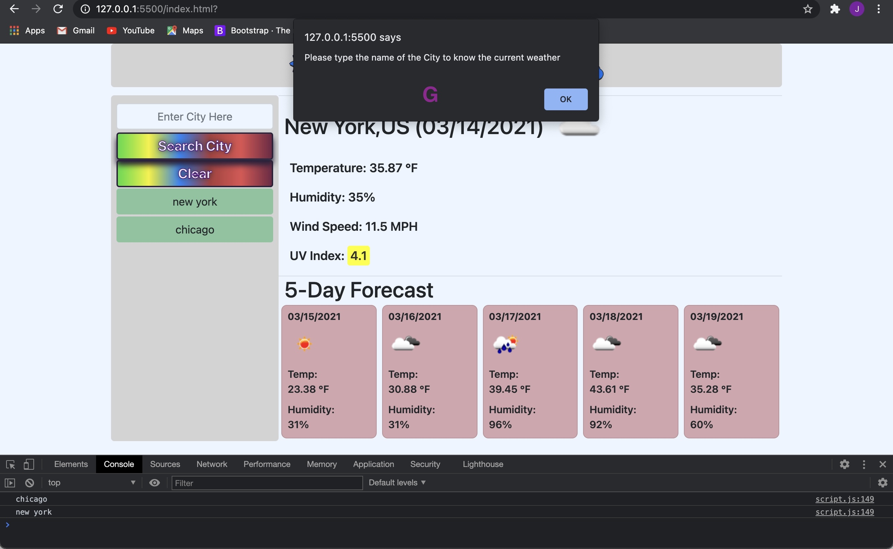
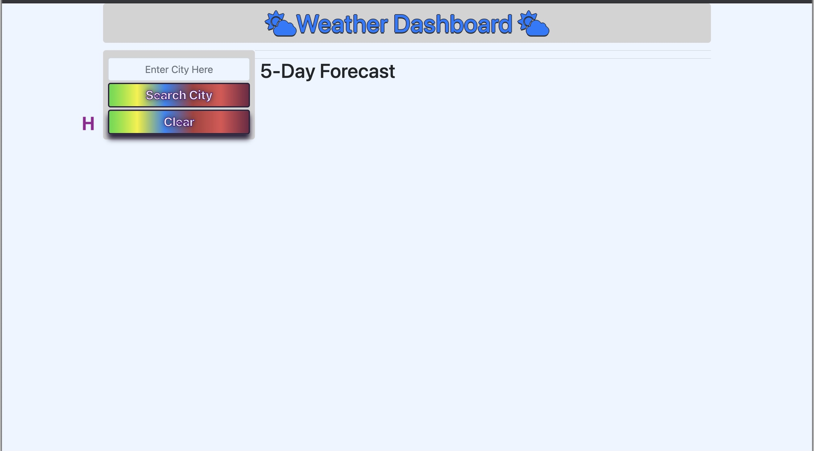

# weatherApp

The Website is mobile Friendly. 

--------------------------------------------------------------------------------------------------------------------------

A. The user has a search bar where they can type in what city they want to know the weather for.

B. After user clicks on the search button it will fetch the data for that city. 

C. The user will then be prompted with the cities Name, Country, Date, Temperature icon, Temperature, Humidity, Wind Speed, and UV Index.

D. The user will also be prompted with the upcoming five day forecast. Displaying Date, Temperature icon, Temperature, and Humidity.

E. All the cities the user searches will be stored in local storage and be displayed on screen as a list. 

F. User searches are saved in console log.

G. If user does not enter a city they will be alerted "Please type the name of the City to know the current weather".

H. The user can then clear all his searches from the page and console log will be cleared as well.

--------------------------------------------------------------------------------------------------------------------------

My Git hub profile : https://github.com/javiistacks

Git Hub repository: https://github.com/javiistacks/weatherApp

Finished Product: https://javiistacks.github.io/weatherApp/
